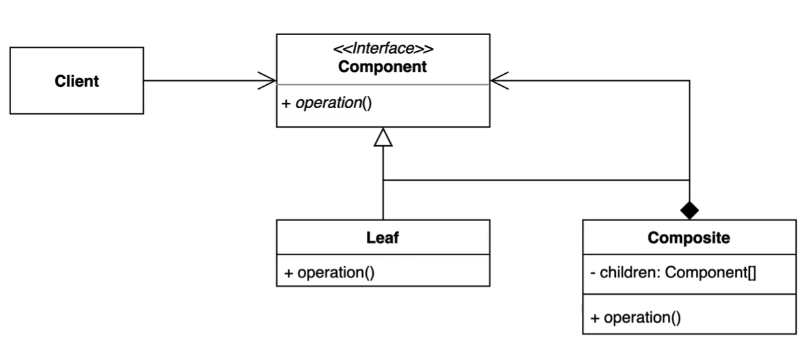

### 컴포짓 패턴

* 컴포짓 패턴은 전체 계층 구조와 전체 계층 구조를 구성하는 부분적인 계층을 Client 입장에서
동일하게 취급할 수 있게끔 구조를 만드는 패턴이다.
* `그룹 전체와 개별 객체를 동일`하게 처리할 수 있는 패턴
* 해당 패턴은 `트리 구조를 구성해야한다는 제약사항`이 있지만 상당히 많이 쓰이는 패턴이다.

#### 장점

* 복잡한 트리 구조를 편리하게 사용할 수 있다.
* 다형성과 재귀를 활용할 수 있다.
* Client 코드를 변경하지 않고 새로운 앨리먼트 타입을 추가할 수 있다. (OCP)

#### 단점

* 트리를 만들어야 하기 때문에 (공통된 인터페이스를 정의해야 하기 때문에) 지나친 일반화를
해야하는 경우도 생길 수 있다.
