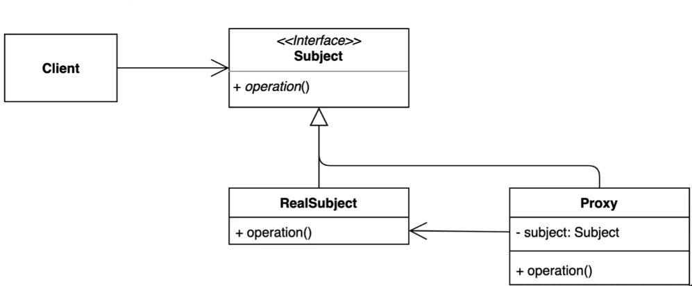

### 프록시 패턴

* 사용하려는 타겟 인스턴스를 `대리인` 을 통해 호출되게 하는 패턴
* 특정 객체애 대한 접근을 제어하거나 기능을 추가할 수 있는 패턴
* 초기화 지연, 접근 제어, 로깅 캐싱 등 다양하게 응용해 사용할 수 있다.
* 타겟 객체를 대리인을 거쳐서 사용하게 되는 패턴이라고 정리할 수 있음.
* 상속을 통해 만들수 있으며, Interface 로도 만들 수 있다. (하지만 interface 를 추천하는 바)

#### 장점

* 기존 코드를 변경하지 않고 새로운 기능을 추가할 수 있다. (OCP)
* 기존 코드가 해야 하는 일만 유지할 수 있다. (SRP)
* 기능 추가 및 초기화 지연 등으로 다양하게 활용할 수 있다.

#### 단점

* 코드의 복잡도가 증가한다.

#### 아니 근데.. 도대체 데코레이터패턴과 프록시패턴이 다른게 뭐냐..?
