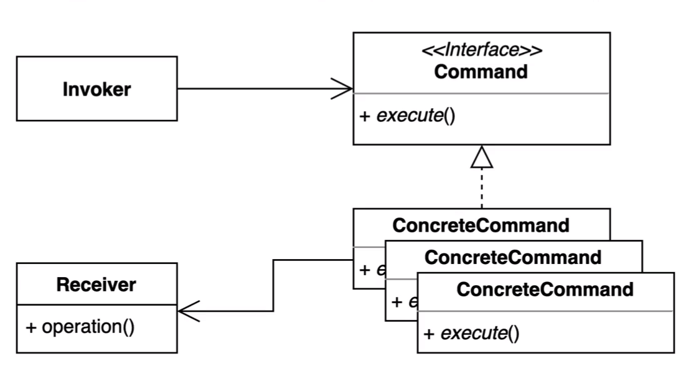

### 커맨드 패턴

* 요청을 호출하는 쪽과 요청을 처리하는 쪽을 디커플링 시키는 패턴 중 하나이다.
* 요청을 캡슐화하여 호출차(Invoker) 와 수신자(Receiver) 를 분리하는 패턴
  

* 요청을 처리하는 방법이 바뀌더라고, 호출자의 코드는 변경되지 않는다.

#### 장점

* 기존 코드를 변경하지 않고 새로운 커맨드를 만들 수 있다.
* 수신자의 코드가 변경되어도 호출자의 코드는 변경되지 않는다.
* 커맨드 객체를 로깅, DB 에 저장, 네트워크로 전송하는 등 다양한 방법으로 활용할 수도 있다.

#### 단점

* 코드가 복잡하고 클래스가 많아진다.
