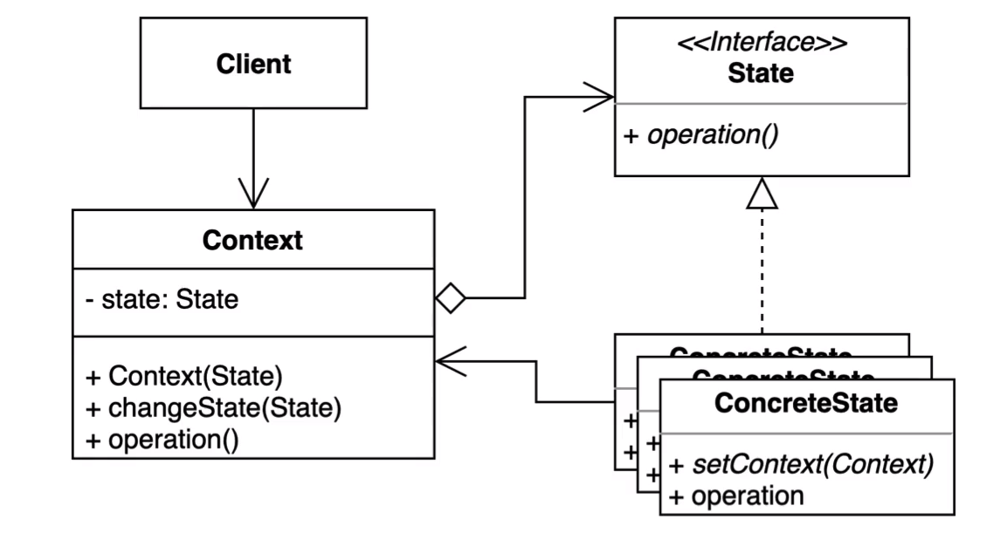

### 상태 패턴

객체 내부 상태 변경에 따라 객체의 행동이 달라지는 패턴

- 상태에 특화된 행동들을 분리해 낼 수 있으며, 새로운 행동을 추가하더라도 다른 행동에 영향을 주지 않는다.

- Context 와 State 가 제일 중요.

#### 장점

- 상태에 따른 개별 클래스를 옮겨서 관리할 수 있다.
- 기존의 특성 상태에 따른 동작을 변경하지 않고 새로운 상태에 다른 동작을 추가할 수 있다.
- 코드 복잡도를 줄일 수 있다.

#### 단점

- 복잡도가 증가한다.

