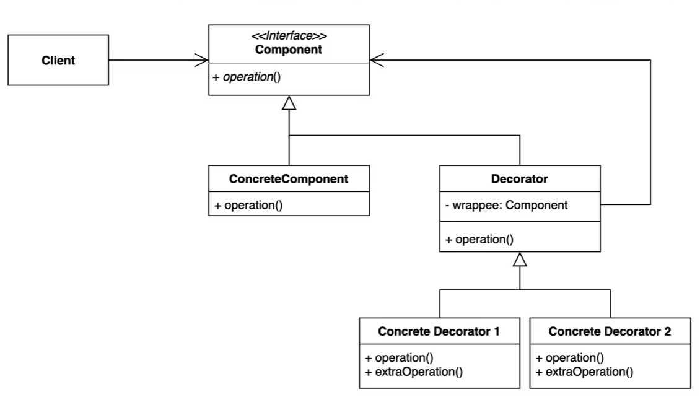

### 데코레이터 패턴

* 데코레이터 패턴은 기존의 코드를 변경하지 않으면서 부가적인 기능을 추가할 수 있는 매우 유용한
구조적인 디자인 패턴이다.

* `상속` 이 아닌 `위임` 을 사용해서 보다 유연하게(런타임에) 부가 기능을 추가하는 것도 가능하다.

* `상속` 을 통해 부가기능을 담당하는 클래스를 생성하면 부가기능 클래스끼리의 조합이 안된다. 하지만
interface 를 통해 `위임` 을 사용하면 `부가 기능 클래스끼리의 조합`이 가능해진다. 따라서 굉장한 유연성을 얻을 수 있다.

#### 장점

* 새로운 클래스를 만들지 않고 기존 기능을 조합할 수 있다.
* 컴파일 타임이 아닌 런타임에 동적으로 기능을 변경할 수 있다.

#### 단점

* 데코레이터를 조합하는 코드가 복잡할 수 있다.
