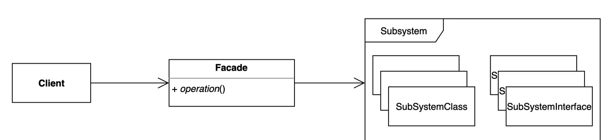

### 퍼사드 패턴

* 복잡한 서브 시스템 의존성을 최소화하는 방법
* 클라이언트가 사용해야 하는 복잡한 서브 시스템 의존성을 간단한 interface 로 추상화를 할 수 있다.
* 복잡한 의존성들을 `Fascade` 라는 `Class` 혹은 `Interface` 의 구현체 뒤로 숨기는 방법.

#### 장점

* 서브 시스템에 대한 의존성을 한곳으로 모을 수 있다.

#### 단점

* 퍼사드 자체가 서브시스템에 대한 모든 의존성을 갖게 된다. (의존성을 피할 수가 없음)

