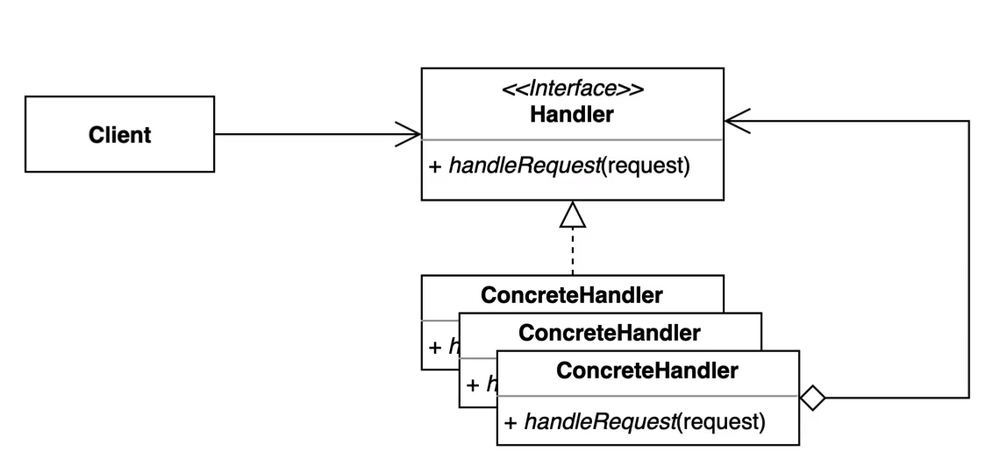

### 책임 연쇄 패턴

* 특정한 책임을 가지고 있는 클래스들이 연결되어 무언가를 처리하는 구조이다.
* 요청을 보내는쪽(sender)과 처리하는(receiver)쪽을 분리하는 패턴이다.

* 해당 패턴을 목적은 핸들러 체인을 사용해서 요청을 처리한다. Client 가 더이상 
구체적인 핸들러 타입을 모르게하여 Client 코드를 변경되지 않고 OCP 를 지킬 수 있게끔 하는것이 
해당 패턴의 목적이다.

1. 해당 패턴을 구현하기 위해서는 `Handler` 라는 인터페이스 혹은 추상클래스가 필요하다.
(다음 체인으로 이어지기위한 필드가 필요하기때문에 추상 클래스를 추천하는 바이다.)

2. 어디에선가는 `Handler` 를 통합한 `Chain` 을 만들어 주어야 한다.

#### 장점

* Client 코드를 변경하지 않고 얼마든지 `Handler` 를 `Chain` 에 추가할 수 있으며
또한, Client 는 구체적인 `Handler` 타입을 알고 있을 필요가 없다. (OCP)

* 각각의 핸들러마다 본인이 할 일만을 수행중이다. (SRP)

* Chain 의 순서를 지정한다던가 마음대로 커스터마이징을 할 수 있다.

#### 단점

* 디버깅이 번거롭다.
